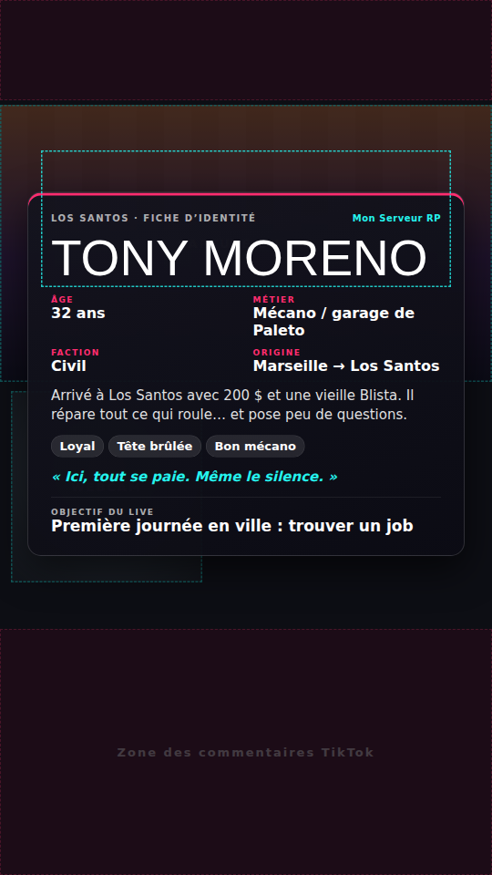
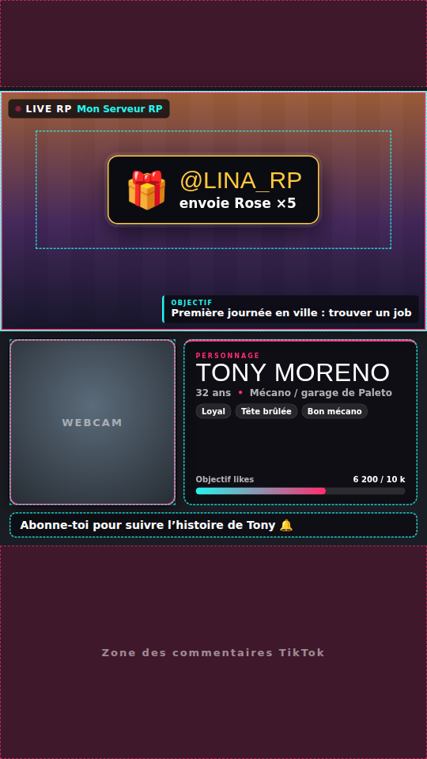
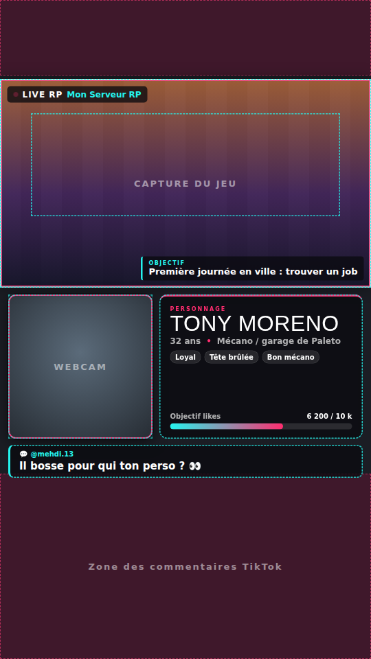
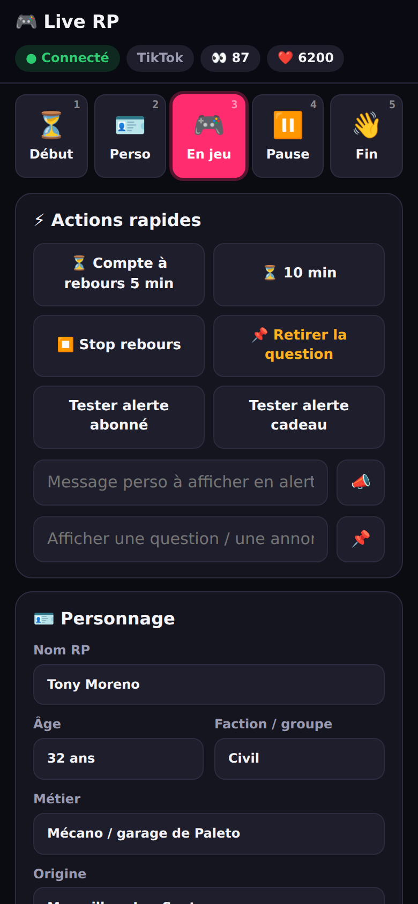
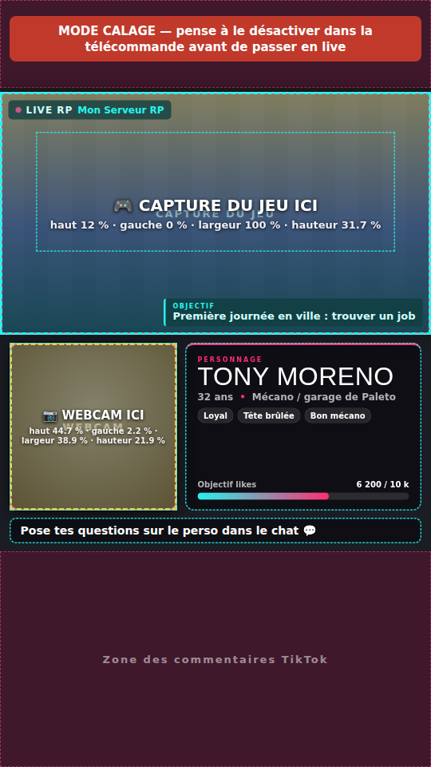

# 🎮 Kit live GTA RP × TikTok LIVE Studio

Pour faire un **live TikTok de présentation GTA RP** en **jouant en même temps**, sans lâcher la manette pour gérer le stream.

| Présentation du perso | En jeu | Question du chat à l'écran | Télécommande (téléphone) |
|---|---|---|---|
|  |  |  |  |

**Ce que fait le kit :**

- 🖼️ **Un overlay vertical** qui s'ajoute dans TikTok LIVE Studio comme source **« Lien »** : fiche de ton perso, objectif du live, barre d'objectif de likes, bandeau défilant, alertes abonnés et cadeaux, écrans *Début / Pause / Fin*.
- 📱 **Une télécommande sur ton téléphone** : tu changes d'écran, tu modifies le texte ou tu affiches une question sans quitter GTA.
- ⌨️ **Des raccourcis clavier en jeu** (`Ctrl+Alt+1…5`) pour passer en *Pause* en une touche, par exemple pendant une scène privée ou quand tu tapes un mot de passe.
- 🔊 **Le chat TikTok lu à voix haute** : tu entends les messages sans quitter la route des yeux. Les questions sont surlignées, et un clic sur 📌 les affiche à l'écran.
- 🔢 **Des compteurs automatiques** (likes, abonnés, cadeaux, spectateurs), lus depuis ton live TikTok.

Le kit tourne **sur ton PC**, ne demande aucun compte et est gratuit. Il n'a besoin que de [Node.js](https://nodejs.org).

---

## 1. Installation (5 minutes, une seule fois)

1. Installe **Node.js LTS** depuis <https://nodejs.org> (Suivant, Suivant, Terminer).
2. Télécharge ce dossier `gta-rp-live` sur ton PC.
3. Double-clique sur **`Lancer-Live.bat`**.
   - Au premier lancement, il installe le module du chat TikTok (environ 30 s).
   - La **télécommande** s'ouvre dans ton navigateur : <http://localhost:7777/>.
   - Laisse la fenêtre noire ouverte pendant tout le live. La fermer arrête le kit.

> 📱 La fenêtre noire affiche aussi l'adresse pour ton téléphone, par exemple `http://192.168.1.23:7777/`. Ouvre-la sur ton téléphone connecté **au même Wi-Fi**. Si Windows demande l'accès au réseau, clique sur **Autoriser**.

## 2. Remplir ta présentation

Dans la télécommande, section **🪪 Personnage** : nom RP, âge, métier, faction, origine, histoire, traits et citation. Section **🏙️ Live & serveur** : objectif du live, nom du serveur et messages du bandeau.

Tout s'enregistre automatiquement et reste en mémoire pour les prochains lives.

## 3. Configurer TikTok LIVE Studio

### a) La capture du jeu

1. Dans GTA / FiveM : **Paramètres → Graphismes → Mode d'affichage : Fenêtré sans bordure**.
   C'est le réglage le plus important pour pouvoir changer de fenêtre (téléphone, chat, LIVE Studio) sans que le jeu plante ou que l'écran devienne noir.
2. Dans LIVE Studio, vérifie que tu es en **format portrait (vertical)**.
3. **Ajouter une source → Capture de jeu**, puis choisis la fenêtre de GTA / FiveM.
   Si l'image reste noire, essaie **Capture de fenêtre**, puis **Capture d'écran** en dernier recours.
4. Ajoute ta **webcam** si tu en as une (**Ajouter une source → Caméra**).

### b) L'overlay (source « Lien »)

1. **Ajouter une source → Lien** (*Link*), puis colle l'adresse : `http://localhost:7777/overlay`
2. Étire la source pour qu'elle **remplisse tout l'écran vertical**. L'overlay garde ses proportions tout seul.
3. Mets la source Lien **au-dessus** de la capture du jeu et de la webcam dans la liste des sources.

### c) Aligner le jeu et la webcam sur les cadres (mode calage)



1. Dans la télécommande : **🖼️ Mise en page → coche « 📐 Mode calage »**.
2. L'overlay affiche en couleur **où placer le jeu** (bleu) et **où placer la webcam** (jaune), avec les positions en % de l'écran.
3. Dans LIVE Studio, déplace et redimensionne la capture du jeu et la webcam pour qu'elles tombent dans ces zones.
4. **Décoche le mode calage.** Le bandeau rouge « MODE CALAGE » te le rappelle tant qu'il est actif.

> Deux mises en page existent : **Classique** (jeu en 16:9 en haut, webcam et fiche dessous, idéal pour une présentation) et **Plein écran** (jeu recadré sur toute la hauteur, plus immersif). Si tu changes de mise en page, refais le calage.
> Pas de webcam ? Décoche **Cadre webcam** et la fiche perso prend toute la largeur.

### d) Le chat lu à voix haute

1. Dans la télécommande, section **💬 Chat TikTok**, tape ton `@pseudo` puis clique sur **Connecter**. Le kit se connecte tout seul dès que ton live démarre, et réessaie toutes les 30 s tant que tu n'es pas en live.
2. Ouvre <http://localhost:7777/chat> dans **Chrome ou Edge** (sur un 2e écran, ou sur ton téléphone) et clique sur **🔊 Lecture vocale**.

> ⚠️ Pour que les spectateurs **n'entendent pas** la voix de lecture, vérifie dans LIVE Studio que le son capturé est **celui du jeu** et pas « tout le son du PC ». Tu peux aussi écouter la lecture au casque depuis ton téléphone.

## 4. Pendant le live

| Moment | Télécommande | Clavier en jeu* |
|---|---|---|
| Avant de démarrer : compte à rebours + « Le live commence » | ⏳ **Début** | `Ctrl+Alt+1` |
| Tu présentes ton perso (fiche d'identité sur le jeu) | 🪪 **Perso** | `Ctrl+Alt+2` |
| Tu joues (HUD compact) | 🎮 **En jeu** | `Ctrl+Alt+3` |
| Scène privée, mot de passe, menu, pause toilettes : **le jeu est caché** | ⏸️ **Pause** | `Ctrl+Alt+4` |
| Fin du live avec le bilan (abonnés, likes, cadeaux) | 👋 **Fin** | `Ctrl+Alt+5` |
| Retirer la question affichée | 📌 **Retirer** | `Ctrl+Alt+0` |

\* Raccourcis clavier : installe [AutoHotkey v2](https://www.autohotkey.com/) (gratuit), puis double-clique sur `tools/raccourcis-live.ahk`. Ils marchent **même quand GTA est au premier plan**. Si ce n'est pas le cas, lance le script en administrateur.

Le déroulé complet d'une présentation de 1 h, avec des phrases toutes prêtes pour faire parler le chat, est dans **[docs/DEROULE-PRESENTATION.md](docs/DEROULE-PRESENTATION.md)**.

## 5. Jouer ET streamer sans lag

- **GTA en « Fenêtré sans bordure »**, et **limite les FPS** du jeu (par exemple 60) : le PC garde de la marge pour encoder le live.
- Dans LIVE Studio (**Paramètres**) : **30 i/s**, **720p ou 1080p**. Choisis l'**encodeur matériel** (NVIDIA, AMD ou Intel) s'il est proposé : il utilise la carte graphique au lieu du processeur, donc le jeu rame moins.
- **Connexion câblée** plutôt que Wi-Fi pour le PC. Il faut au moins **6 Mbit/s en envoi** (à tester sur un speedtest).
- Ferme ce qui consomme pour rien : navigateur avec 30 onglets, launchers, téléchargements.
- **Un seul écran ?** Mets le chat vocal sur ton téléphone, pilote avec les raccourcis clavier et ne quitte jamais le jeu.
- Mode **« streamer »** du serveur ou de FiveM s'il existe : il masque les infos sensibles (IP, identifiants).
- ⚠️ **Règles RP** : ce que tu lis dans le chat ne doit **jamais** être utilisé en jeu (métagaming). Les « stream snipers » peuvent aussi regarder ton live pour te retrouver en jeu. En cas de doute, passe en **Pause**.

## 6. Problèmes fréquents

<details>
<summary><b>Un rectangle noir avec le logo TikTok apparaît sur mon écran</b></summary>

C'est presque toujours que **LIVE Studio (ou une page TikTok) se capture lui-même**. TikTok bloque l'affichage de ses propres fenêtres et les remplace par ce bandeau noir.
- Vérifie qu'aucune source **Capture d'écran** ou **Capture de fenêtre** ne vise LIVE Studio ou un onglet tiktok.com.
- Préfère **Capture de jeu** sur la fenêtre de GTA / FiveM, et passe GTA en **Fenêtré sans bordure**.
- Pendant les écrans de chargement de GTA, la capture peut aussi être vide un instant. C'est normal, l'image revient en jeu.
</details>

<details>
<summary><b>L'overlay est vide ou n'apparaît pas dans LIVE Studio</b></summary>

- La fenêtre noire du kit (`Lancer-Live.bat`) doit être **ouverte**.
- Vérifie l'adresse exacte : `http://localhost:7777/overlay`
- Clic droit sur la source Lien → **Actualiser** (ou supprime et recrée la source).
- Teste dans Chrome : <http://localhost:7777/overlay?preview=1>. Si ça s'affiche là, le problème vient de la source dans LIVE Studio.
</details>

<details>
<summary><b>Le fond de l'overlay est noir au lieu d'être transparent</b></summary>

Il faut bien une source **Lien** (pas une Capture de fenêtre d'un navigateur). Si ta version de LIVE Studio n'a pas la source Lien, mets-la à jour.
</details>

<details>
<summary><b>La télécommande ne s'ouvre pas sur mon téléphone</b></summary>

- Même Wi-Fi que le PC (pas en 4G/5G).
- Utilise l'adresse affichée dans la fenêtre noire (`http://192.168.x.x:7777/`), pas `localhost`.
- Pare-feu Windows : autorise **Node.js** sur les réseaux **privés**.
</details>

<details>
<summary><b>Le chat TikTok ne se connecte pas</b></summary>

- Le chat ne se connecte **que quand tu es en live**. Avant, le kit affiche « pas (encore) en live » et réessaie tout seul.
- Vérifie le pseudo (sans espace, par exemple `@ton_pseudo`).
- Ce module n'est **pas officiel** et TikTok le bloque parfois. Tout le reste du kit continue de fonctionner. Dans ce cas, lis le chat dans LIVE Studio et épingle une question en la tapant dans la télécommande (📌).
- Tu peux ajouter une clé gratuite [Euler Stream](https://www.eulerstream.com) si les connexions échouent souvent (voir *Options avancées*).
</details>

## 7. Options avancées

Variables à définir avant le lancement (dans `Lancer-Live.bat`, ligne `set NOM=valeur` avant `node server.js`) :

| Variable | Rôle | Défaut |
|---|---|---|
| `PORT` | Port du kit (change aussi l'adresse de l'overlay et le script `.ahk`) | `7777` |
| `LIVE_PIN` | Code demandé pour modifier l'overlay depuis le réseau (conseillé en colocation ou sur un Wi-Fi partagé) | aucun |
| `TIKTOK_USERNAME` | Pseudo TikTok connecté au démarrage | celui saisi dans la télécommande |
| `EULER_API_KEY` | Clé Euler Stream pour un chat plus fiable | aucune |

**Adresses utiles :**

- `/overlay?preview=1&debug`: aperçu avec un faux jeu et les zones de l'interface TikTok (où ne rien mettre d'important)
- `/overlay?mode=pause`: écran de pause fixe, si tu veux une scène « Pause » séparée dans LIVE Studio
- `/overlay?layout=full`: force la mise en page plein écran

**API locale**, pour Stream Deck, Touch Portal, etc. (requêtes `POST`) :

```
POST /api/mode/{starting|intro|live|pause|ending}
POST /api/alert      {"type":"custom","text":"Braquage en cours 🚨"}
POST /api/pin        {"user":"pseudo","text":"question"}   (corps vide = retirer)
POST /api/countdown  {"minutes":5}
PATCH /api/state     {"objective":"…","character":{"name":"…"}}
```

## 8. Développement

```bash
npm test             # 25 tests : état, serveur, API, pont TikTok
npm start            # lance le serveur
npm run screenshots  # régénère docs/images (nécessite Playwright)
```

```
gta-rp-live/
├── server.js               serveur HTTP + flux temps réel (SSE), aucune dépendance obligatoire
├── lib/state.js            état du live + validation de toutes les entrées
├── lib/tiktok-bridge.js    pont optionnel vers le chat TikTok (reconnexion auto)
├── public/overlay.*        overlay 9:16 (mise à l'échelle auto, modes, alertes, calage)
├── public/control.*        télécommande (PC + mobile)
├── public/chat.*           chat + lecture vocale + épinglage
├── public/layout.js        zones de la mise en page (jeu, webcam, fiche, zones TikTok)
├── tools/raccourcis-live.ahk  raccourcis clavier en jeu (AutoHotkey v2)
└── Lancer-Live.bat         lancement en double-clic (Windows)
```
